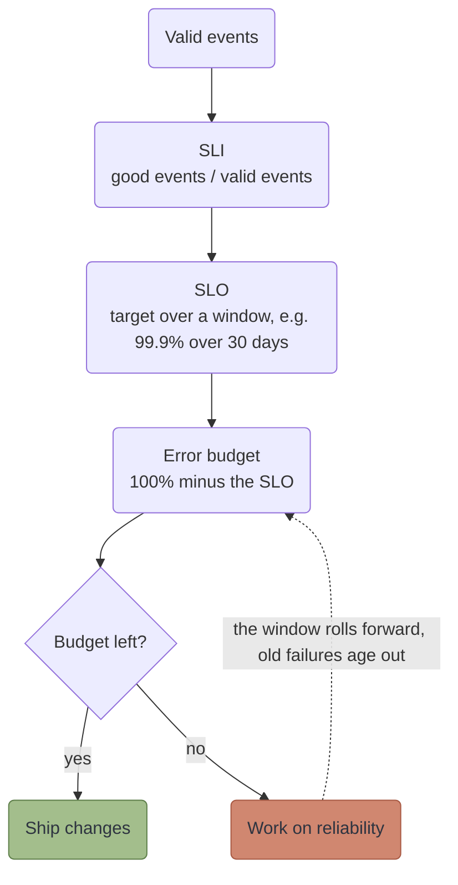
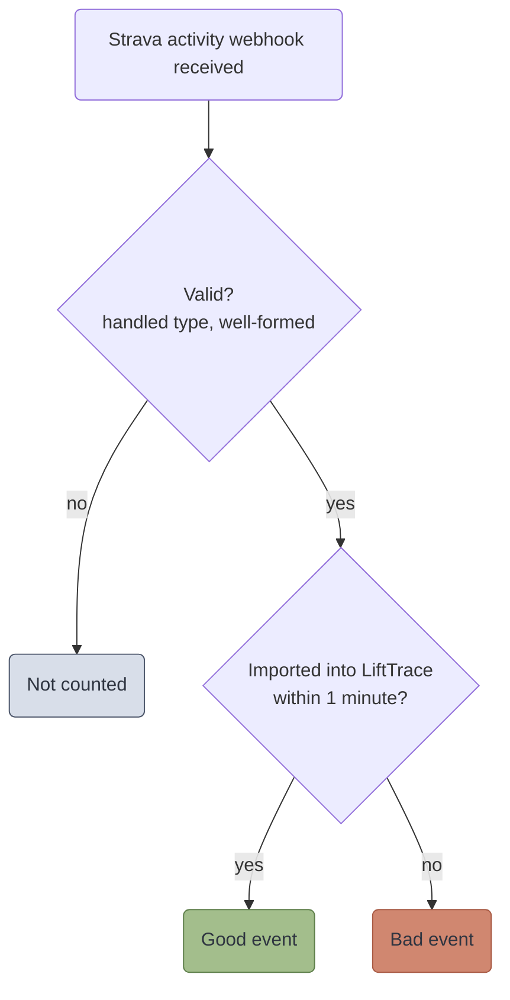

I've been working through Google's SRE book and its companion, the SRE Workbook, and the first thing they make you do is get three terms straight: SLI, SLO, and error budget. I kept mixing them up. I'm keeping a notebook of diagrams on paper for myself, but I figured the short version belongs here too, with numbers from stuff I actually run at home.

## The three terms

An **SLI** (service level indicator) is a number that tells you how the service is doing. It's a ratio: good events divided by valid events. That's it.

An **SLO** (service level objective) is the target for that number over a window of time. Say, 99.9% over 30 days.

The **error budget** is whatever the SLO lets you get wrong. It's 100% minus the SLO. At 99.9% over 30 days you can fail 0.1% of valid events, which works out to about 43 minutes of full outage.

The budget is the part that clicked for me. It turns "is this reliable enough?" into something you can check. If there's budget left, you keep shipping. If it's gone, you stop and work on reliability until it comes back. The window rolls forward, so old failures age out and the budget refills.

My first question was the obvious one. If I've been down 5 minutes this month, do I still have budget? Yes. A 99.9% SLO allows about 43 minutes, so 5 minutes is roughly 12% spent and I have about 38 minutes left.

## My first SLI was wrong

I run a small Cloudflare Worker that connects my self-hosted LiftTrace to Strava. Right now it sends my workouts to Strava. I want to add the other direction, so a run I log in Strava shows up in LiftTrace as cardio. That part isn't built yet.

When I tried to come up with an SLI for it, I wrote down "number of cardio workouts imported from Strava." That's a count, and a count isn't an SLI. It doesn't tell you how many *should* have been imported. An SLI is a ratio, so this one becomes:

> activities imported into LiftTrace within 1 minute, divided by all valid Strava activity webhooks the Worker receives

I also got "valid" backwards the first time. I said a valid event is one that shows up in the database. If that's your definition, every failed import never makes it to the database, so it never counts, and your SLI sits at 100% while imports are failing. Valid events get defined at the input, when the webhook arrives. "Shows up in the database" is what makes an event *good*.

What I leave out of valid events: health checks, activity types I skip on purpose, and requests that were malformed to begin with. A scheduled test event that travels the real path does count, because it's measuring the real service.

## Pick the SLI from what you see

There are four common kinds.

| Kind | Question it answers |
|---|---|
| Availability | Did the request succeed? |
| Latency | Was it fast enough? Use the share of requests under a threshold, not an average. |
| Freshness | Is the data recent enough? |
| Correctness | Is the answer right? |

Start with one or two per service. The Strava sync covers availability and latency in one number, because "imported within 1 minute" fails on a lost event and on a slow one.

## Traffic changes what an SLO can tell you

I assumed the Strava sync saw an event or so a day. It's closer to three a week. That matters a lot, so I pulled real numbers from my Prometheus for a couple of other things I run. These are from the last 7 to 14 days, scaled to 30.

| Service | Events per 30 days | Failures a 99.9% SLO allows | What one failure does |
|---|---|---|---|
| Strava sync | about 12 | 0.012 | 8% error rate, the whole budget gone |
| ArgoCD syncs | about 195 | 0.2 | 0.5% error rate, still over a 99.9% budget |
| Pi-hole DNS queries | about 900,000 | about 900 | nothing you could measure |

Pi-hole is where an SLO behaves like the books say. It answers roughly 30,000 queries a day, and in the last week it returned zero SERVFAIL or REFUSED replies. ArgoCD is in the middle. With about 195 syncs a month, a 99% SLO (about 2 failures) is the realistic one. The Strava sync is the low-traffic case: at 12 events a month, a single failed webhook is an 8% error rate.

The Workbook's section on low-traffic services lists three options: generate artificial traffic, combine small services into a larger one for monitoring, or change the product so a failure does less damage. It also warns about the first one. If a problem hurts real users but not the artificial traffic, the successful fake requests hide it, so you never hear about it.

On top of that, there are a few things I'm doing for the Strava sync:

1. Send a known test event on a schedule so there's steady traffic, and keep an eye on the real events too, for the reason above.
2. Alert on longer windows, a day or more.
3. Open a ticket instead of paging, since one lost webhook shouldn't wake me up.

Loosening the SLO is another option. That's what I'd do for ArgoCD, but at 12 events a month one failure is still over budget.

## The Pi-hole one, in code

Pi-hole was the first SLO I wrote for real, since it has the traffic to make the numbers mean something. The SLI is a DNS probe that runs every minute, and the SLO is 99.9% over 30 days. The alerts and the dashboard come out of a small module I added to my [terraform-kubernetes-observability](https://github.com/Mosher-Labs/terraform-kubernetes-observability/tree/v0.17.0/modules/slo) repo.

- [The SLO definition](https://github.com/Mosher-Labs/homelab-gitops/blob/0801da680aa7c29c7db2ac24f2885536295227e8/infrastructure/observability-alerts/locals.tf#L84) is about ten lines of Terraform.
- [The SLO document](https://github.com/Mosher-Labs/homelab-gitops/blob/0801da680aa7c29c7db2ac24f2885536295227e8/docs/slos/pihole-dns.md) says what's measured, why 99.9%, and what I haven't checked yet.

One thing surprised me. I left the fastest alert out on purpose. With a probe once a minute, a single failed probe in an hour is already a burn rate of 16.7, so one blip would page me. I'll explain what that number means in the next post.

I did test it. I made temporary copies of the two alerts, fed them a fake 95% success rate, and both fired in Slack and Webex. Then I switched the fake rate to 100% and the resolved messages showed up in both.

## What's next

An SLO only helps if something is watching it. The next post covers burn-rate alerts, the part that turns an error budget into an alert that pages me for a fast problem and just opens a ticket for a slow one.

The sources for all of this are the SRE book's chapter on [service level objectives](https://sre.google/sre-book/service-level-objectives/) and the Workbook's chapter on [implementing SLOs](https://sre.google/workbook/implementing-slos/).
