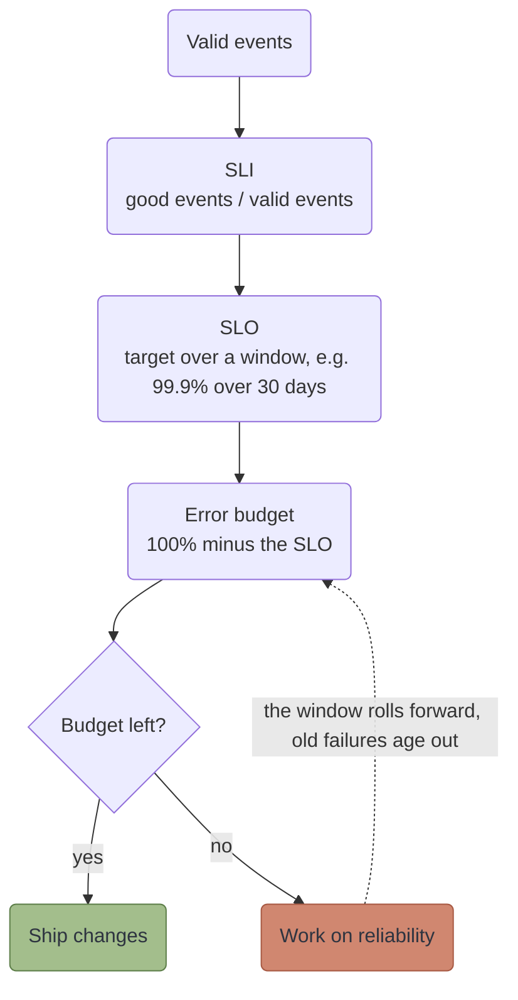
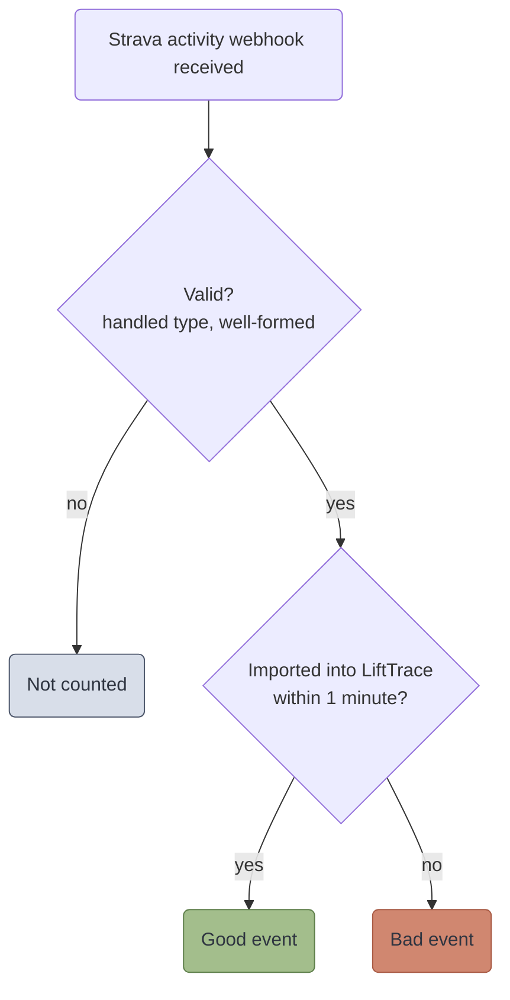

I have been working through the Google SRE Workbook, and the first thing it asks you to get straight is three terms: SLI, SLO and error budget. I kept mixing them up, so I wrote them down in order. This is that list, with an example from something I run at home.

## The three terms

- **SLI (service level indicator):** a number that tells you how the service is doing. It is a ratio: good events divided by valid events.
- **SLO (service level objective):** the target for that number over a window of time. For example, 99.9% over 30 days.
- **Error budget:** the amount the SLO allows to fail. It is 100% minus the SLO. At 99.9% over 30 days, you can fail 0.1% of valid events, which is about 43 minutes of full outage.

The budget turns "is this reliable enough?" into a number you can check. If budget remains, you keep shipping changes. If it is gone, you work on reliability until it recovers. The window rolls forward, so old failures age out and the budget refills.

If you have been down 5 minutes in a 30-day window, you have used about 12% of a 99.9% budget. About 38 minutes remain.

## A worked example: the Strava sync

I run a small Cloudflare Worker that connects my self-hosted LiftTrace to Strava. I am adding the other direction: when I log an activity in Strava, it should show up in LiftTrace as a cardio entry.

My first idea for an SLI was "the number of cardio workouts imported from Strava." A count is not an SLI, because it does not say how many should have been imported. An SLI is a ratio:

> activities imported into LiftTrace within 1 minute, divided by all valid Strava activity webhooks the Worker receives

**Valid events** are everything the service is responsible for. I define them at the input, the webhook arriving, and not at the output. If I defined valid as "shows up in the database," every failed import would drop out of the count and the SLI would read 100% while imports were failing.

**Good events** are the valid ones that met the target: imported within 1 minute.

Things I leave out of valid events: health checks, activity types I skip on purpose, and requests that were malformed to begin with. A scheduled test event that travels the real path counts, because it measures the real service.

## Pick the SLI from what you see

There are four common kinds:

| Kind | Question it answers |
|---|---|
| Availability | Did the request succeed? |
| Latency | Was it fast enough? Use the share of requests under a threshold, not an average. |
| Freshness | Is the data recent enough? |
| Correctness | Is the answer right? |

Start with one or two per service. The Strava sync covers availability and latency in one number, because "imported within 1 minute" fails on both a lost event and a slow one.

## Low-traffic services

My Strava sync sees about three events a week, roughly 12 in a 30-day window. At that volume the percentages stop meaning much. A 99.9% SLO allows 0.012 failed events in that window, and even 99% allows 0.12. A single failure is an 8% error rate, so one bad webhook uses the whole budget.

The Workbook lists several ways to handle low traffic:

1. Send a known test event on a schedule so there is steady traffic.
2. Alert on longer windows, such as 3 days or more.
3. Wait for a minimum number of events before alerting.
4. Open a ticket instead of paging for services that do not need to wake anyone.
5. Loosen the SLO. This helps a busy service, but at 12 events a month one failure is still over budget.

For the Strava sync I am going with a scheduled test event, so the SLI has steady traffic, and ticket-only alerts, so one lost webhook never wakes me up.

## What is next

An SLO is only useful if something watches it. The next post covers burn-rate alerts: how to turn an error budget into alerts that page you for fast problems and open tickets for slow ones. I am building that into my [terraform-kubernetes-observability](https://github.com/Mosher-Labs/terraform-kubernetes-observability) module.

The source for all of this is the [SRE Workbook chapter on implementing SLOs](https://sre.google/workbook/implementing-slos/).
