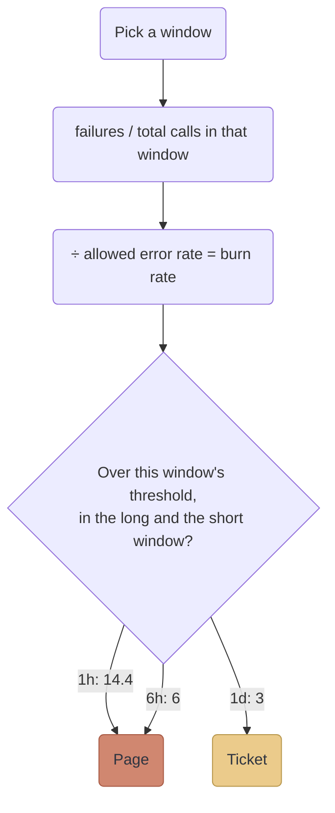

Last time I wrote down what an SLI, an SLO, and an error budget are. An SLO doesn't do anything on its own, though. Something has to watch the budget and tell you when you're burning through it too fast. That's a burn-rate alert, and the part that took me the longest to get was where the time window comes in.

## Burn rate

Burn rate is how fast you're spending the budget compared to how fast the SLO allows. You get it by dividing the error rate you're seeing by the error rate you're allowed.

At 99.9% the allowed error rate is 0.1%. If 1.44% of requests are failing, the burn rate is 14.4. If the failures stop at exactly 0.1%, the burn rate is 1, and the budget lasts the whole 30 days. A burn rate of 10 empties it in 3 days.

The time window is just the stretch of time you count over. "The last hour" means: take the failures and the total calls from the last hour, divide, then divide by 0.1%. Pick a different window and you count a different stretch, but the formula stays the same.

Here's a real one. Pi-hole answers about 30,000 queries a day, so roughly 1,250 an hour. Say 18 of them fail in an hour. That's 1.44%, a burn rate of 14.4. Held for that hour, it uses 2% of the month's budget: 14.4 hours' worth, out of the 720 hours in 30 days. Two failed queries in the same hour is 0.16%, a burn rate of 1.6, and nothing needs to happen.

## Three alerts, two windows each

The Workbook doesn't use one alert. It uses three, each tied to how much of the budget you're willing to lose before somebody hears about it.

| Alert | Burn rate | Long window | Short window | Budget spent in the long window | What happens |
|---|---|---|---|---|---|
| Fast | 14.4 | 1h | 5m | 2% | Page |
| Medium | 6 | 6h | 30m | 5% | Page |
| Slow | 3 | 1d | 2h | 10% | Ticket |

Fast and severe problems page me. A slow leak only opens a ticket, since it can wait until morning.

Each alert looks at two windows, and both have to be over the threshold. The long window tells you the problem is real and not a blip. The short window is there so the alert clears soon after the problem stops, instead of staying red for an hour after you've fixed it.

The numbers aren't magic. Each one comes from how much budget you want to spend: burn rate times the window length, divided by the 720 hours in 30 days. The fast row is 14.4 x 1 / 720 = 2%. The slow row is 3 x 24 / 720 = 10%.

One thing I didn't expect: the Workbook's third alert is 1x over 3 days. Datadog won't take a window longer than 48 hours, so I used Datadog's version, 3x over 1 day. It spends the same 10% of the budget. I use the same three on both Grafana and Datadog so they behave the same.

## A bug I found in my own alert

On Grafana I can't ask for "both windows over the threshold" directly, so my alert compares the smaller of the two burn rates against the threshold. That works, except for one case I only found while reviewing it. If one window has no data, the `min()` quietly ignores it, and the alert fires on the other window alone. That's exactly what the two windows were supposed to prevent. I tested it against Prometheus to be sure, then added a guard that keeps the alert quiet unless both windows have a value.

## Pi-hole, and why I left the fast alert off

The Pi-hole SLO is built on a DNS probe that runs once a minute. With one probe a minute, a single failed probe in an hour is 1 out of 60, or 1.7%. That's a burn rate of 16.7, which is over 14.4. One blip would page me.

So Pi-hole only has the medium and slow alerts. Medium needs a burn rate of 6 over 6 hours, which is about 3 failed probes out of 360 (2 gets you 5.6, just under). That tells a real problem from a blip. The cost is that a 2-minute outage doesn't page me in real time.

You can see how it's set up in [the Pi-hole SLO definition](https://github.com/Mosher-Labs/homelab-gitops/blob/0801da680aa7c29c7db2ac24f2885536295227e8/infrastructure/observability-alerts/locals.tf#L84), where `tiers = ["medium", "slow"]` is the one line that leaves the fast alert off. The three tiers and the thresholds are defined [in the module](https://github.com/Mosher-Labs/terraform-kubernetes-observability/blob/v0.17.0/modules/slo/locals.tf#L8), and the burn rate for each window is worked out from the budget share.

I tested the alerts the same way as before. I made temporary copies of the two Pi-hole alerts, fed them a fake 95% success rate, and watched both fire and then resolve in Slack and Webex.

## The short version

Burn rate is the error rate you see divided by the one you're allowed. Pick a window, count over it, and compare it to that window's threshold. The two windows keep the alert honest, and a quiet service needs fewer alerts, not more.

The sources are the Workbook's chapter on [alerting on SLOs](https://sre.google/workbook/alerting-on-slos/) and Datadog's page on [burn rate alerts](https://docs.datadoghq.com/service_level_objectives/burn_rate/). The first post in this pair covers the [SLI, SLO and error budget side](/learning/2026/10/06/slis-slos-and-error-budgets.html).
